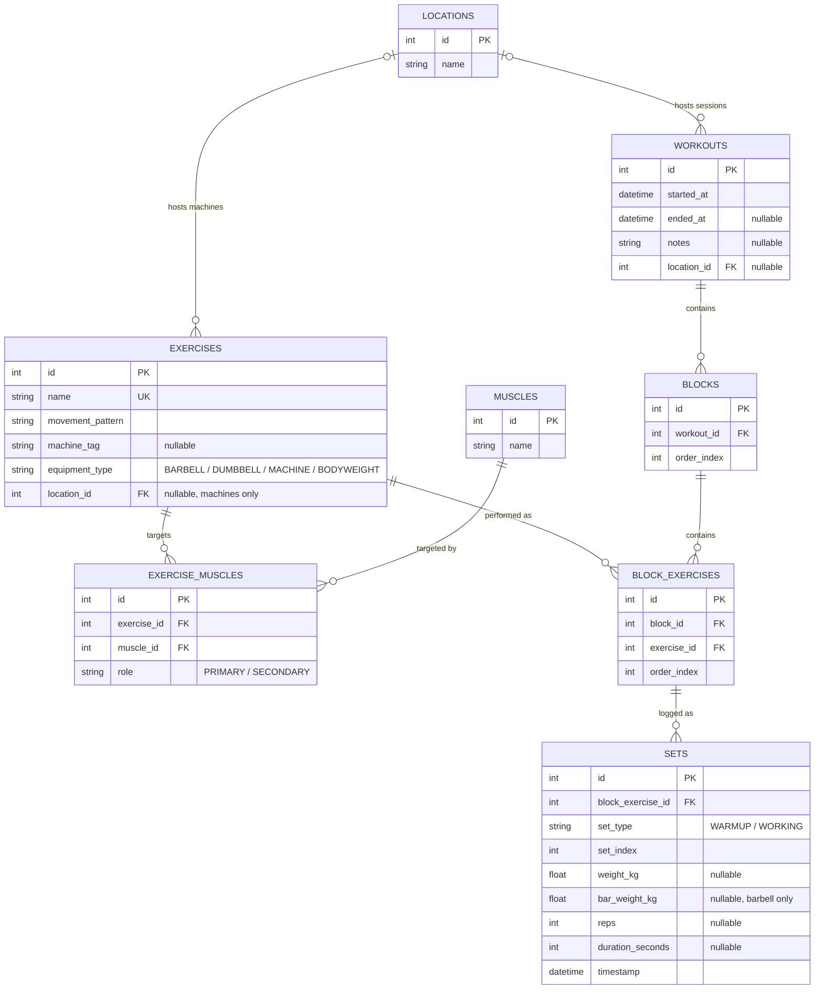

```mermaid
    erDiagram
        LOCATIONS {
            int id PK
            string name
        }

        EXERCISES {
            int id PK
            string name UK
            string movement_pattern
            string machine_tag "nullable"
            string equipment_type "BARBELL / DUMBBELL / MACHINE / BODYWEIGHT"
            int location_id FK "nullable, machines only"
        }

        MUSCLES {
            int id PK
            string name
        }

        EXERCISE_MUSCLES {
            int id PK
            int exercise_id FK
            int muscle_id FK
            string role "PRIMARY / SECONDARY"
        }

        WORKOUTS {
            int id PK
            datetime started_at
            datetime ended_at "nullable"
            string notes "nullable"
            int location_id FK "nullable"
        }

        BLOCKS {
            int id PK
            int workout_id FK
            int order_index
        }

        BLOCK_EXERCISES {
            int id PK
            int block_id FK
            int exercise_id FK
            int order_index
        }

        SETS {
            int id PK
            int block_exercise_id FK
            string set_type "WARMUP / WORKING"
            int set_index
            float weight_kg "nullable"
            float bar_weight_kg "nullable, barbell only"
            int reps "nullable"
            int duration_seconds "nullable"
            datetime timestamp
        }

        LOCATIONS |o--o{ EXERCISES : "hosts machines"
        LOCATIONS |o--o{ WORKOUTS : "hosts sessions"
        EXERCISES ||--o{ EXERCISE_MUSCLES : "targets"
        MUSCLES ||--o{ EXERCISE_MUSCLES : "targeted by"
        EXERCISES ||--o{ BLOCK_EXERCISES : "performed as"
        WORKOUTS ||--o{ BLOCKS : "contains"
        BLOCKS ||--o{ BLOCK_EXERCISES : "contains"
        BLOCK_EXERCISES ||--o{ SETS : "logged as"
```
